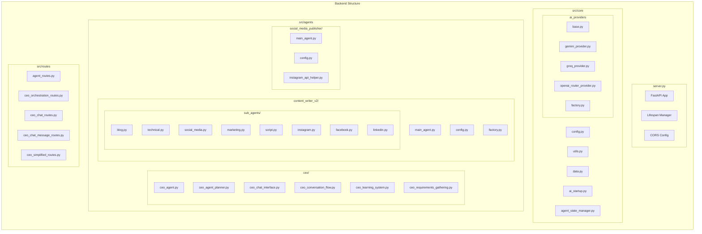
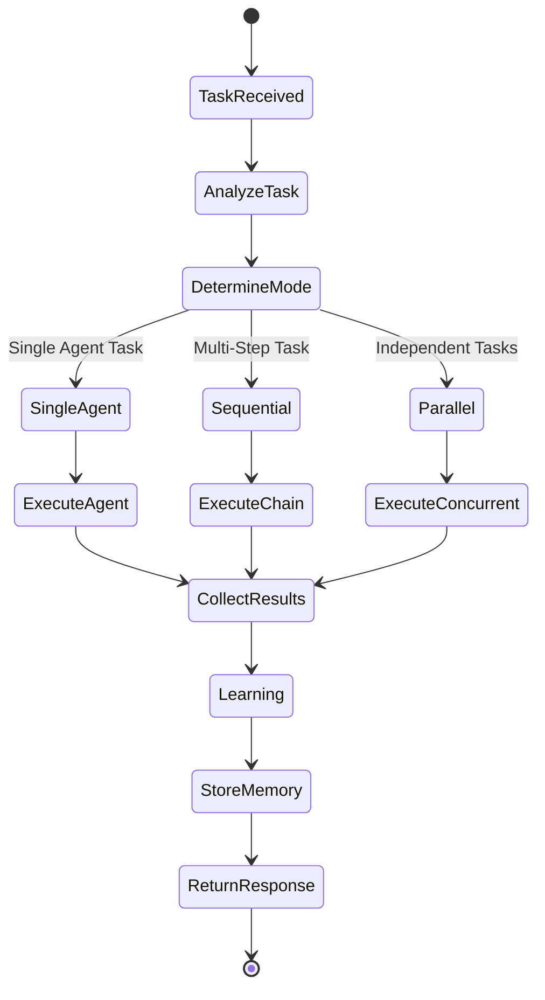
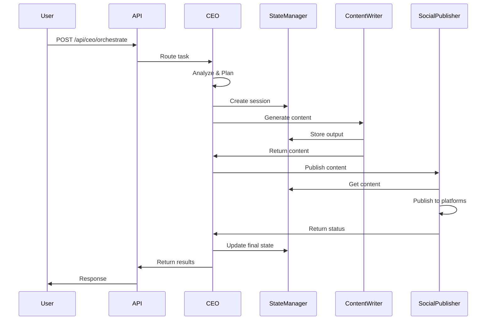
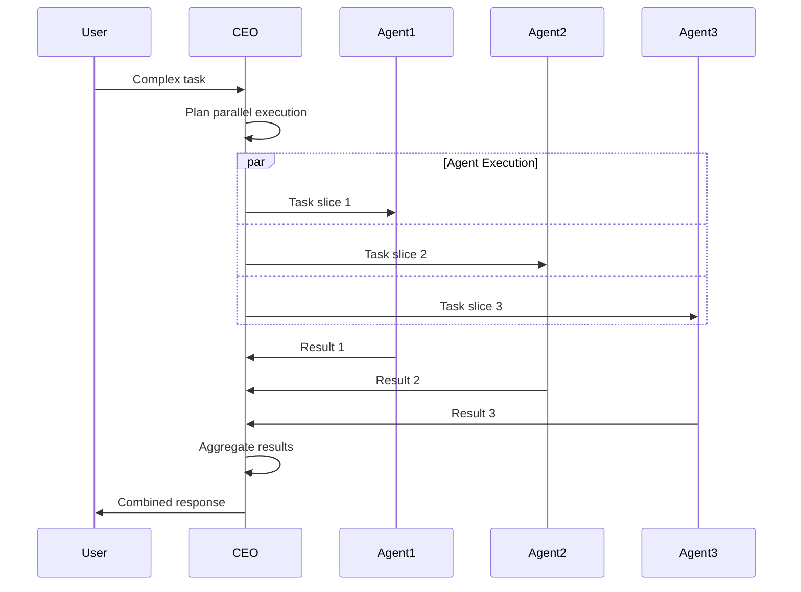

# Backend Business Requirements Document (BRD)
## AI Startup Operating System - Backend Architecture

### Table of Contents
1. [Executive Summary](#executive-summary)
2. [System Overview](#system-overview)
3. [Architecture Diagram](#architecture-diagram)
4. [Agent System](#agent-system)
5. [CEO Agent Details](#ceo-agent-details)
6. [API Routes and Endpoints](#api-routes-and-endpoints)
7. [Agent Communication Flow](#agent-communication-flow)
8. [Technology Stack](#technology-stack)
9. [Getting Started](#getting-started)

---

## Executive Summary

The AI Startup Operating System is a sophisticated multi-agent system designed to automate various aspects of running a startup. The backend implements a CEO agent that orchestrates specialized AI agents across different teams to handle tasks ranging from content creation to social media publishing.

### Key Features:
- **Multi-Agent Architecture**: 20+ specialized AI agents organized into 4 teams
- **CEO Orchestration**: Intelligent task routing and execution planning
- **Real AI Integration**: Support for multiple AI providers (Gemini, OpenAI, Groq)
- **State Management**: Persistent state tracking across agent interactions
- **RESTful API**: Comprehensive endpoints for agent interaction

---

## System Overview

### High-Level Architecture

```mermaid
graph TB
    subgraph "Frontend"
        UI[React UI]
        CEO_CHAT[CEO Chat Interface]
    end
    
    subgraph "API Gateway"
        ROUTES[FastAPI Routes]
        MW[Middleware]
    end
    
    subgraph "Core System"
        CEO[CEO Agent]
        SM[State Manager]
        AI[AI Service]
    end
    
    subgraph "Agent Teams"
        subgraph "Marketing Team"
            CW[Content Writer v2]
            SP[Social Publisher]
            SEO[SEO Specialist]
            EM[Email Marketer]
            BA[Brand Advisor]
        end
        
        subgraph "Tech Team"
            FS[Full Stack Dev]
            CD[Cloud DevOps]
            SEC[Security Expert]
            DA[Data Analyst]
            UX[UX Designer]
        end
        
        subgraph "Business Team"
            PM[Product Manager]
            SA[Sales Agent]
            CS[Customer Success]
            FA[Finance Analyst]
            HR[HR Manager]
        end
        
        subgraph "Creative Team"
            GD[Graphic Designer]
            VE[Video Editor]
            COP[Copywriter]
            CM[Community Manager]
            PR[PR Specialist]
        end
    end
    
    UI --> ROUTES
    CEO_CHAT --> ROUTES
    ROUTES --> MW
    MW --> CEO
    CEO --> SM
    CEO --> AI
    CEO --> CW
    CEO --> SP
    CEO --> SEO
    CEO --> EM
    CEO --> BA
    CEO --> FS
    CEO --> CD
    CEO --> SEC
    CEO --> DA
    CEO --> UX
    CEO --> PM
    CEO --> SA
    CEO --> CS
    CEO --> FA
    CEO --> HR
    CEO --> GD
    CEO --> VE
    CEO --> COP
    CEO --> CM
    CEO --> PR
```



---

## Architecture Diagram

### Component Architecture



---

## Agent System

### Agent Organization

The system consists of 20 specialized agents organized into 4 teams:

#### 1. Marketing Team (5 agents)
- **Content Writer** (`content_writer`): Creates various types of content
  - Blog posts, technical documentation, social media captions
  - Marketing copy, video scripts
  - Uses Content Writer v2 with specialized sub-agents
  
- **Social Media Publisher** (`social_publisher`): Manages social media distribution
  - Publishes to Instagram, Facebook, LinkedIn
  - Handles scheduling and analytics
  - Image upload and caption management
  
- **SEO Specialist** (`seo_specialist`): Search engine optimization
- **Email Marketer** (`email_marketer`): Email campaign management
- **Brand Advisor** (`brand_advisor`): Brand strategy and consistency

#### 2. Tech Team (5 agents)
- **Full Stack Developer** (`full_stack_dev`): Code generation and review
- **Cloud DevOps Engineer** (`cloud_devops`): Infrastructure management
- **Security Expert** (`security_expert`): Security audits and compliance
- **Data Analyst** (`data_analyst`): Data analysis and insights
- **UX Designer** (`ux_designer`): User experience design

#### 3. Business Team (5 agents)
- **Product Manager** (`product_manager`): Product strategy and roadmap
- **Sales Agent** (`sales_agent`): Sales operations and CRM
- **Customer Success Manager** (`customer_success`): Customer support
- **Finance Analyst** (`finance_analyst`): Financial planning
- **HR Manager** (`hr_manager`): Human resources management

#### 4. Creative Team (5 agents)
- **Graphic Designer** (`graphic_designer`): Visual design
- **Video Editor** (`video_editor`): Video content creation
- **Copywriter** (`copywriter`): Creative writing
- **Community Manager** (`community_manager`): Community engagement
- **PR Specialist** (`pr_specialist`): Public relations

---

## CEO Agent Details

### CEO Agent Architecture

The CEO agent is the central orchestrator of the system:



### CEO Capabilities

1. **Task Analysis**: Uses LLM to understand user intent
2. **Agent Selection**: Intelligently routes tasks to appropriate agents
3. **Execution Modes**:
   - **Single**: One agent handles the entire task
   - **Sequential**: Chain of agents (output feeds next input)
   - **Parallel**: Multiple agents work simultaneously
4. **Learning System**: Stores and learns from past interactions
5. **Requirements Gathering**: Interactive clarification of user needs
6. **Chat Interface**: Conversational interaction with memory

### CEO Components

- **ceo_agent.py**: Core CEO logic and orchestration
- **ceo_agent_planner.py**: LLM-based planning system
- **ceo_chat_interface.py**: Chat interaction handler
- **ceo_conversation_flow.py**: Conversation state management
- **ceo_learning_system.py**: Learning and memory system
- **ceo_requirements_gathering.py**: Requirements analysis
- **ceo_simplified_flow.py**: Simplified execution flow

---

## API Routes and Endpoints

### Base URL: `http://localhost:8000`

### 1. Health & System Endpoints

| Endpoint | Method | Description |
|----------|--------|-------------|
| `/health` | GET | Health check endpoint |
| `/api/teams` | GET | List all teams and agents |

### 2. Agent Execution Endpoints

| Endpoint | Method | Description | Request Body |
|----------|--------|-------------|---------------|
| `/api/agents/{agent_id}/execute` | POST | Execute specific agent | `{"task": "string", "context": {}}` |
| `/api/simple/agents/{agent_id}/execute` | POST | Simple agent execution | `{"task": "string"}` |

### 3. CEO Orchestration Endpoints

| Endpoint | Method | Description | Request Body |
|----------|--------|-------------|---------------|
| `/api/orchestrate` | POST | CEO orchestration (deprecated) | `{"task": "string"}` |
| `/api/ceo/orchestrate` | POST | CEO orchestration | `{"task": "string"}` |
| `/api/ceo/plan` | POST | Get CEO execution plan | `{"task": "string"}` |
| `/api/ceo/execute-plan` | POST | Execute a specific plan | `{"plan": {}, "task": "string"}` |

### 4. CEO Chat Endpoints

| Endpoint | Method | Description | Request Body |
|----------|--------|-------------|---------------|
| `/api/ceo/chat` | POST | Start CEO chat session | `{"message": "string"}` |
| `/api/ceo/chat/{session_id}` | GET | Get chat history | - |
| `/api/ceo/chat/{session_id}` | DELETE | End chat session | - |
| `/api/ceo/chat/{session_id}/message` | POST | Send message in session | `{"message": "string"}` |

### 5. CEO Requirements Gathering

| Endpoint | Method | Description | Request Body |
|----------|--------|-------------|---------------|
| `/api/ceo/requirements/start` | POST | Start requirements session | `{"initial_request": "string"}` |
| `/api/ceo/requirements/{session_id}/continue` | POST | Continue gathering | `{"user_response": "string"}` |
| `/api/ceo/requirements/{session_id}/status` | GET | Get session status | - |

### 6. CEO Simplified Flow

| Endpoint | Method | Description | Request Body |
|----------|--------|-------------|---------------|
| `/api/ceo/simplified/execute` | POST | Simplified execution | `{"task": "string"}` |

---

## Agent Communication Flow

### Sequential Execution Flow



### Parallel Execution Flow



---

## Technology Stack

### Core Technologies
- **Framework**: FastAPI (Python 3.8+)
- **Async**: asyncio for concurrent operations
- **AI Providers**: 
  - Google Gemini (primary)
  - OpenAI (via OpenRouter)
  - Groq (alternative)

### Key Libraries
- **Web Framework**: `fastapi`, `uvicorn`
- **AI/ML**: `google-generativeai`, `openai`, `groq`
- **Social Media**: `requests` (Instagram API)
- **Utilities**: `pydantic`, `python-dotenv`

### Architecture Patterns
- **Microservices**: Each agent is independently deployable
- **Event-Driven**: State changes trigger agent actions
- **Factory Pattern**: Dynamic agent and provider creation
- **Strategy Pattern**: Multiple AI provider implementations

---

## Getting Started

### Prerequisites
```bash
# Python 3.8 or higher
python --version

# Virtual environment
python -m venv venv
```

### Installation
```bash
# Clone repository
git clone <repository-url>
cd startup-os/backend

# Install dependencies
pip install -r requirements.txt
```

### Configuration
```bash
# Copy environment template
cp .env.example .env

# Configure AI providers
GEMINI_API_KEY=your_gemini_key
OPENROUTER_API_KEY=your_openrouter_key
GROQ_API_KEY=your_groq_key

# Configure social media (optional)
INSTAGRAM_ACCESS_TOKEN=your_instagram_token
```

### Running the Server
```bash
# Development mode
python run_backend.py

# Production mode
uvicorn server:app --host 0.0.0.0 --port 8000
```

### Testing
```bash
# Run all tests
python -m pytest tests/

# Run specific test
python -m pytest tests/test_content_writer_v2.py
```

---

## API Usage Examples

### 1. Simple Content Creation
```bash
curl -X POST http://localhost:8000/api/agents/content_writer/execute \
  -H "Content-Type: application/json" \
  -d '{"task": "Write a blog post about AI in startups"}'
```

### 2. CEO Orchestration
```bash
curl -X POST http://localhost:8000/api/ceo/orchestrate \
  -H "Content-Type: application/json" \
  -d '{"task": "Create and publish a social media campaign about our new product"}'
```

### 3. CEO Chat Session
```bash
# Start session
curl -X POST http://localhost:8000/api/ceo/chat \
  -H "Content-Type: application/json" \
  -d '{"message": "I need help with marketing strategy"}'

# Continue conversation
curl -X POST http://localhost:8000/api/ceo/chat/{session_id}/message \
  -H "Content-Type: application/json" \
  -d '{"message": "Focus on social media marketing"}'
```

---

## State Management

The system uses a sophisticated state management system to track agent interactions:

```python
# State structure
{
    "session_id": "uuid",
    "timestamp": "2024-01-01T00:00:00Z",
    "agents_involved": ["content_writer", "social_publisher"],
    "outputs": {
        "content_writer": "Generated content...",
        "social_publisher": "Published to 3 platforms"
    },
    "metadata": {
        "execution_mode": "sequential",
        "total_duration": 15.3
    }
}
```

---

## Error Handling

The system implements comprehensive error handling:

1. **API Level**: HTTP status codes and error messages
2. **Agent Level**: Graceful fallbacks and retry logic
3. **AI Provider Level**: Automatic failover between providers
4. **Logging**: Detailed logs for debugging

---

## Security Considerations

1. **API Keys**: Stored in environment variables
2. **CORS**: Configurable allowed origins
3. **Input Validation**: Pydantic models for all inputs
4. **Rate Limiting**: Planned for production
5. **Authentication**: JWT tokens (planned)

---

## Future Enhancements

1. **Agent Marketplace**: Dynamic agent loading
2. **WebSocket Support**: Real-time agent updates
3. **Multi-tenancy**: Organization-level isolation
4. **Analytics Dashboard**: Agent performance metrics
5. **Plugin System**: Custom agent development SDK

---

## Conclusion

The AI Startup Operating System backend provides a robust, scalable foundation for building AI-powered automation. With its multi-agent architecture, intelligent orchestration, and comprehensive API, it enables rapid development of complex AI workflows while maintaining flexibility and extensibility.

For detailed implementation guides and API documentation, refer to the specific README files in each module directory.