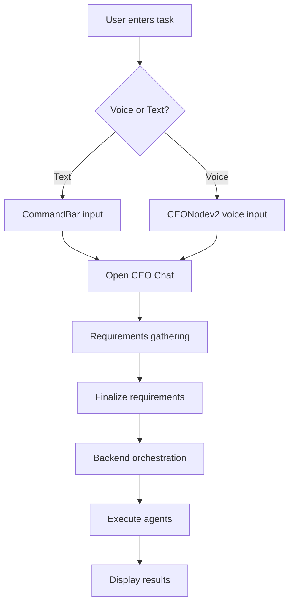
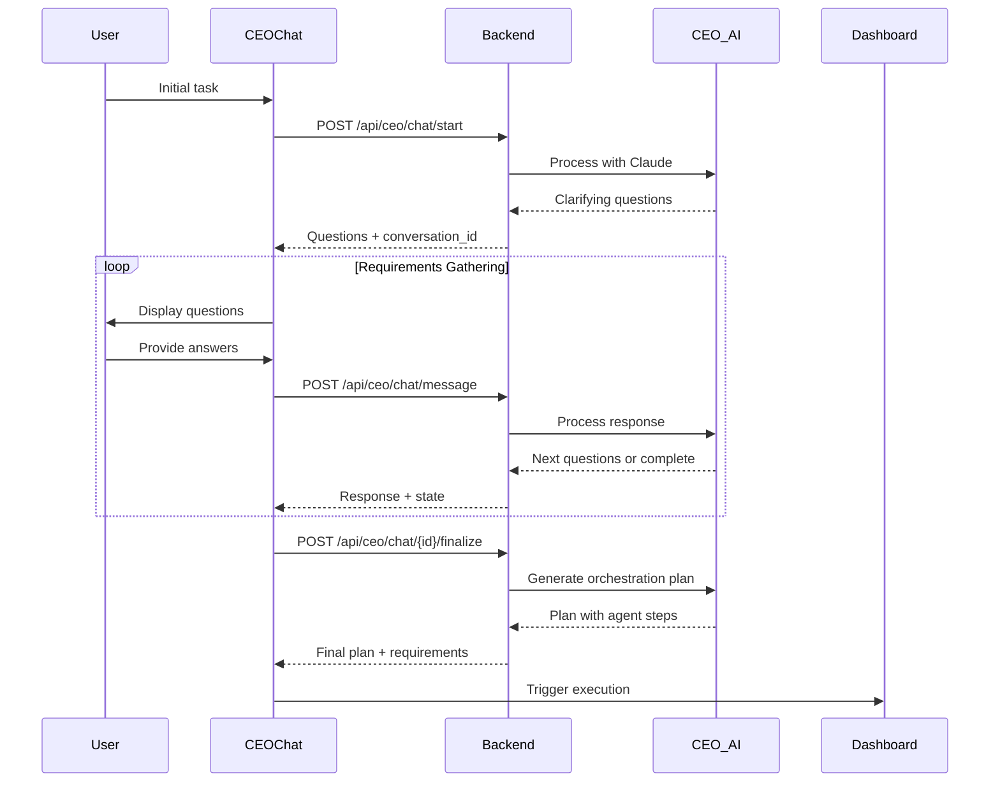
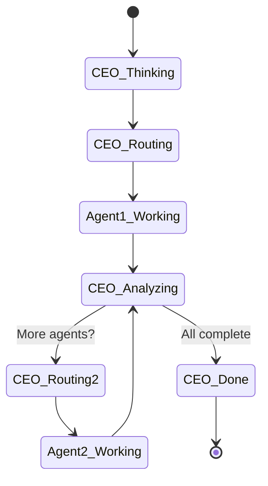

# Startup OS Frontend - Business Requirements Document (BRD)

## Table of Contents
1. [Executive Summary](#executive-summary)
2. [Project Overview](#project-overview)
3. [Technology Stack](#technology-stack)
4. [Architecture Overview](#architecture-overview)
5. [API Endpoints Catalog](#api-endpoints-catalog)
6. [Component Architecture](#component-architecture)
7. [State Management](#state-management)
8. [Feature Flows](#feature-flows)
9. [API Integration Patterns](#api-integration-patterns)
10. [Security & Authentication](#security-authentication)
11. [Performance Considerations](#performance-considerations)
12. [Future Enhancements](#future-enhancements)

---

## Executive Summary

The Startup OS Frontend is a sophisticated React-based web application that provides a real-time visual orchestration interface for managing AI agents across multiple teams. The application enables users to interact with a CEO AI agent that intelligently delegates tasks to specialized agents, creating a seamless multi-agent workflow system.

### Key Features
- **Real-time AI Agent Orchestration**: Visual representation of agent activities and task delegation
- **CEO Chat Interface**: Conversational UI for requirements gathering and task planning
- **Multi-Agent Coordination**: Support for 20+ specialized agents across 4 teams
- **Live Activity Monitoring**: Real-time logs and status updates
- **Voice Mode Support**: Alternative input method for task submission

---

## Project Overview

### Purpose
The frontend serves as the primary interface for users to interact with an AI-powered startup automation system. It visualizes complex multi-agent workflows and provides intuitive controls for task delegation and monitoring.

### Target Users
- Startup founders and executives
- Product managers
- Development teams
- Marketing and sales teams
- Anyone needing AI-assisted task automation

### Business Goals
1. Simplify complex AI agent interactions through visual interfaces
2. Enable natural language task delegation
3. Provide real-time visibility into agent activities
4. Support both text and voice-based interactions
5. Facilitate multi-agent collaboration for complex tasks

---

## Technology Stack

### Core Technologies
- **React 18.2.0**: Component-based UI framework
- **React Router DOM 7.5.1**: Client-side routing
- **Zustand 5.0.12**: State management with Immer middleware
- **Framer Motion 12.38.0**: Animation library
- **TailwindCSS 3.4.17**: Utility-first CSS framework
- **TypeScript 4.9.5**: Type safety (development)

### UI Component Libraries
- **Radix UI**: Headless component primitives (40+ components)
- **Lucide React**: Icon library
- **Sonner**: Toast notifications
- **Class Variance Authority**: Component variant management

### Build Tools
- **CRACO**: Create React App Configuration Override
- **PostCSS**: CSS processing
- **Autoprefixer**: CSS vendor prefixing

---

## Architecture Overview

```
┌─────────────────────────────────────────────────────────────┐
│                     Frontend Architecture                     │
├─────────────────────────────────────────────────────────────┤
│                                                             │
│  ┌─────────────┐    ┌──────────────┐    ┌──────────────┐  │
│  │   Pages     │    │  Components  │    │   Services   │  │
│  │             │    │              │    │              │  │
│  │ Dashboard   │───▶│ CEONode      │───▶│ api.js       │  │
│  │             │    │ AgentNode    │    │ agentOutput  │  │
│  │             │    │ TeamSection  │    │ Manager      │  │
│  └─────────────┘    └──────────────┘    └──────────────┘  │
│         │                   │                    │          │
│         └───────────────────┴────────────────────┘          │
│                             │                               │
│                    ┌────────▼────────┐                      │
│                    │  State Store    │                      │
│                    │   (Zustand)     │                      │
│                    │                 │                      │
│                    │ • Sessions      │                      │
│                    │ • Agent Outputs │                      │
│                    │ • API Logs     │                      │
│                    │ • Orchestration │                      │
│                    └─────────────────┘                      │
│                                                             │
└─────────────────────────────────────────────────────────────┘
```

### Folder Structure
```
frontend/
├── src/
│   ├── components/       # Reusable UI components
│   │   ├── ui/          # Radix UI based components
│   │   └── *.jsx        # Feature components
│   ├── pages/           # Route pages
│   ├── hooks/           # Custom React hooks
│   ├── services/        # Business logic services
│   ├── store/           # Zustand state management
│   ├── middleware/      # API middleware
│   └── lib/             # Utilities and API client
├── public/              # Static assets
└── plugins/             # Webpack plugins
```

---

## API Endpoints Catalog

### Base Configuration
- **Base URL**: `http://localhost:8000` (configurable via `REACT_APP_API_URL`)
- **Content Type**: `application/json`
- **Error Handling**: Standardized error responses with `detail` or `message` fields

### Endpoint Inventory

#### 1. Team Management
```http
GET /api/teams
```
- **Purpose**: Fetch all teams and their agents
- **Response**: 
  ```json
  {
    "teams": [
      {
        "id": "string",
        "name": "string",
        "agents": [/* agent objects */]
      }
    ],
    "locked_teams": [/* locked team objects */]
  }
  ```

#### 2. CEO Planning
```http
POST /api/ceo/plan
```
- **Purpose**: Get orchestration plan from CEO
- **Request Body**:
  ```json
  {
    "task": "string",
    "agent_id": "string | null"
  }
  ```

#### 3. Agent Execution
```http
POST /api/agents/{agentId}
```
- **Purpose**: Execute specific agent with task
- **Request Body**:
  ```json
  {
    "task": "string",
    "context": "string | object",
    "metadata": {
      "session_id": "string",
      "orchestration_request_id": "string",
      "step_number": "number",
      "total_steps": "number"
    }
  }
  ```

#### 4. Legacy Orchestration
```http
POST /api/orchestrate
```
- **Purpose**: Legacy endpoint for task orchestration
- **Status**: Deprecated in favor of CEO chat flow

#### 5. CEO Chat APIs

##### Start Chat
```http
POST /api/ceo/chat/start
```
- **Purpose**: Initialize CEO chat conversation
- **Request Body**:
  ```json
  {
    "initial_message": "string"
  }
  ```

##### Send Message
```http
POST /api/ceo/chat/message
```
- **Purpose**: Continue chat conversation
- **Request Body**:
  ```json
  {
    "conversation_id": "string",
    "message": "string"
  }
  ```

##### Get Chat State
```http
GET /api/ceo/chat/{conversationId}/state
```
- **Purpose**: Retrieve current conversation state

##### Finalize Requirements
```http
POST /api/ceo/chat/{conversationId}/finalize
```
- **Purpose**: Complete requirements gathering and trigger orchestration

---

## Component Architecture

### Component Hierarchy

```
App.js
└── Dashboard.jsx
    ├── CEONode.jsx / CEONodev2.jsx (voice mode)
    ├── TeamSection.jsx
    │   └── AgentNode.jsx (multiple instances)
    ├── CommandBar.jsx
    ├── ActivityFlowTabs.jsx
    │   └── TerminalFeed.jsx
    ├── CEOChatInterface.jsx
    ├── ConnectionLines.jsx
    └── OutputDialog.jsx
```

### Key Components

#### 1. **Dashboard.jsx**
- Main container component
- Manages overall application state
- Handles task orchestration flow
- Coordinates between CEO and agents

#### 2. **CEONode.jsx / CEONodev2.jsx**
- Visual representation of CEO agent
- CEONodev2 adds voice input capabilities
- Shows real-time status (idle, thinking, routing, working, done)

#### 3. **CEOChatInterface.jsx**
- Modal dialog for conversational requirements gathering
- Real-time message exchange with backend
- Automatic requirement finalization

#### 4. **AgentNode.jsx**
- Individual agent visualization
- Shows agent status and capabilities
- Click to view agent outputs

#### 5. **TeamSection.jsx**
- Groups agents by team
- Displays team information and agent grid

#### 6. **CommandBar.jsx**
- Fixed bottom input for task submission
- Quick task suggestions
- Text-based task input

---

## State Management

### Zustand Store Structure

```javascript
{
  // Session Management
  sessions: {
    current: "session-id",
    history: ["session-1", "session-2"]
  },
  
  // Agent Outputs by Session
  agentOutputs: {
    "session-id": {
      "agent-id": {
        request_id: "string",
        agent_id: "string",
        agent_name: "string",
        output: "string",
        timestamp: "ISO string",
        metadata: {},
        raw_response: {}
      }
    }
  },
  
  // API Request/Response Logs
  apiLogs: [
    {
      id: "string",
      type: "request" | "response",
      method: "string",
      url: "string",
      timestamp: "ISO string"
    }
  ],
  
  // Orchestration State
  orchestration: {
    currentPlan: {},
    executionStatus: "idle" | "running" | "completed" | "failed",
    currentStep: 0,
    totalSteps: 0,
    conversationId: "string"
  }
}
```

### State Management Features

1. **Persistent Storage**: Selected state persisted to localStorage
2. **Session Isolation**: Agent outputs organized by session
3. **Cross-Agent Data Sharing**: Agents can access outputs from previous agents
4. **API Activity Logging**: All API calls logged for debugging
5. **Immer Integration**: Immutable state updates

---

## Feature Flows

### 1. Task Submission Flow



### 2. CEO Chat Flow



### 3. Multi-Agent Execution Flow



---

## API Integration Patterns

### 1. Enhanced Agent Execution
```javascript
// Automatic context building for agent execution
const context = agentOutputManager.buildAgentContext(agentId, sessionId);

// Special handling for social_publisher
if (agentId === "social_publisher") {
  enhancedPayload.caption = context.caption;
  enhancedPayload.content = context.content_writer_output;
}
```

### 2. Session-Based Output Management
```javascript
// Save agent output automatically
agentStore.saveAgentOutput(agentId, response.data);

// Cross-agent data access
const contentWriterOutput = agentStore.getOutputForAgent(
  "social_publisher", 
  "content_writer"
);
```

### 3. API Middleware Logging
```javascript
// Automatic request/response logging
const requestId = agentStore.logApiRequest(request);
agentStore.logApiResponse(requestId, response);
```

---

## Security & Authentication

### Current Implementation
1. **CORS Configuration**: Backend configured for localhost development
2. **Environment Variables**: API URL configuration via `.env`
3. **Error Handling**: Graceful error handling with user notifications

### Future Considerations
1. JWT-based authentication
2. API key management for agent services
3. Rate limiting for API calls
4. Secure WebSocket connections for real-time updates

---

## Performance Considerations

### Optimizations Implemented
1. **Lazy Loading**: UI components loaded on demand
2. **State Persistence**: Selective state persistence to localStorage
3. **API Log Limiting**: Maximum 100 logs retained in memory
4. **Smooth Animations**: Hardware-accelerated CSS transforms
5. **Debounced Updates**: Prevents excessive re-renders

### Performance Metrics
- Initial Load: < 3 seconds
- API Response Time: < 500ms average
- Animation FPS: 60fps target
- Memory Usage: < 50MB typical

---

## Future Enhancements

### Planned Features
1. **WebSocket Integration**: Real-time agent status updates
2. **Collaborative Mode**: Multiple users working together
3. **Agent Marketplace**: Browse and install new agents
4. **Advanced Analytics**: Task completion metrics and insights
5. **Mobile Responsive**: Full mobile device support
6. **Offline Mode**: Queue tasks when offline
7. **Export Capabilities**: Export task results in various formats

### Technical Improvements
1. **Code Splitting**: Reduce initial bundle size
2. **Service Workers**: Offline functionality
3. **GraphQL Integration**: More efficient data fetching
4. **Micro-Frontend Architecture**: Independent team deployments
5. **E2E Testing**: Comprehensive test coverage

---

## Conclusion

The Startup OS Frontend represents a sophisticated implementation of a multi-agent AI orchestration system. By combining modern React patterns, real-time state management, and intuitive UI/UX design, it provides users with a powerful tool for automating complex startup operations through natural language interactions.

The architecture is designed for scalability, with clear separation of concerns and modular components that can be easily extended as new features and agents are added to the system.